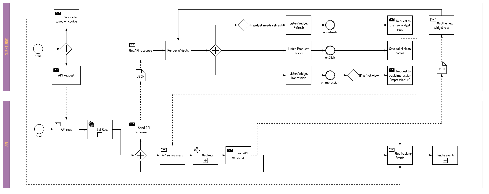

# Onsite-demo documentation

## Description

- [Used features and project decisions](#features)
- Brief of widget types [here](./widgets-brief.md).
- [Brief of the recommendation documentation, description of api response](#doc-rec)
- [General flow of widgets implementation](#flow)
- Description of each widget type, it behaviors and singularities [here](./widgets-description).
- [Code tips and tricks, general and for specific widgets](#tips)

## <a name="features">Used features and project decisions</a>

### List of features

- `jQuery-3.3.1`: https://jquery.com/
- `EJS`: https://ejs.co/
- `ESLint`: https://eslint.org/
- `Webpack`: https://webpack.js.org/
- `@linx-impulse/commons-js`: https://github.com/chaordic/commons-js/
- `Owl Carousel 2`: https://owlcarousel2.github.io/OwlCarousel2/
- `Slick carousel`: http://kenwheeler.github.io/slick/
- `Onsite-SDK`: https://github.com/chaordic/engage-onsite-sdk-js

### Project decisions and some explanations

- `@linx-impulse/commons-js`: reusing some util functions from this repo.
- `Onsite-SDK`: SDK interface to use api.
- `Owl Carousel 2`: plugin used to build the horizontal carousels.
- `Slick carousel`: plugin used to build the vertical carousels.
- The project has the components structures for a clear and easy framework migration (such as React, Vue, Angular, etc).
- The file `utils.js` has some very specific functions, explained on [Code tips and tricks](#tips).

## Brief of widget types [here](./widgets-brief.md)

## <a name="doc-rec">Brief of the recommendation doc, description of api response</a>

The api documentation is [here](https://docs.chaordic.com.br/v0-api-vitrines/docs/get-pages-recommendations).

### API usage

- Insert valid inputs, the project uses the [Onsite SDK](https://github.com/chaordic/engage-onsite-sdk-js) to validate and make the api request.
- Render the widget based on the response.
- Listen impression (track if the widget is in the user ViewPort). **Obs:** The impression can also be configured via back-end.
- Listen clicks (track products clicks).
- Listen refreshes (depending on the type of widget is necessary refresh the widget. Ex: reference, push, history, fbt). **Obs:** remember to relisten the impression and clicks when refreshed.

## <a name="flow">General flow of widgets implementation</a>

Flow description using BPMN 2.0.
Reference: https://www.bpmnquickguide.com/

### BPMN

[Better visualization](https://raw.githubusercontent.com/chaordic/onsite-demo/master/docs/assets/apibpmn.png)

## Description of each widget type, it behaviors and singularities [here](./widgets-description)

## <a name="tips">Code tips and tricks, general and for specific widgets</a>

- For the impression, save the widget id globally to check if it was already seen. (For the products with reference you may need to make a tuple with the reference, because the widget id keeps the same).
- Url params options insertion (development).
- If you use EJS you may need a function similar to the `ejsInject` on `utils.js`, because EJS only works on build.
- Remember to use callbacks to render properly (async request to api).
