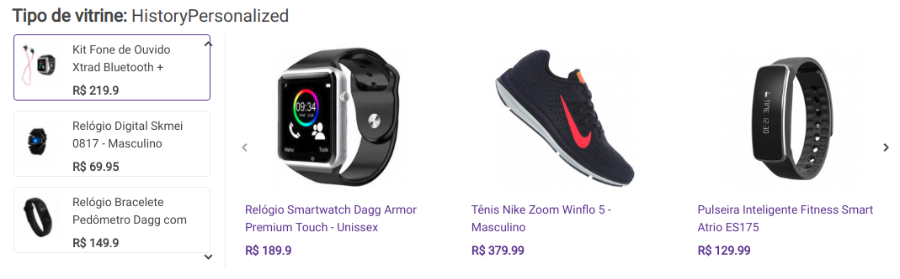

# Widgets brief

Brief of widgets: https://lancamentos.chaordic.com.br/category/guia/

## List of widgets types

The types of widget will be separated based on similar features.

- ````<type of widget> (<file on code>): <description>.````
- default (`widget.js`): default widget type, a carousel of products (push without menu, history without references).
- reference (`referenceWidget.js`): widgets with one reference, the carousel of products is based on the reference product. The reference product can be changed, the carousel of products changes with reference.
- push (`pushWidget.js`): similar to the default widget but the push widget has exhibition rules to filter the recommended products. An optional feature is the menu push, for each menu is showed a different carousel of products, similar to the reference widget.
- history (`historyWidget.js`): widget based on user history, there is a carousel of references with one reference selected. The carousel of products changes with the reference,
- frequently bought together (`frequentlyBoughtWidget.js`): widget for product page, it shows three cards, one is the product of the page and the others are recommendations that can be changed to buy items together.

## Widgets types prints

### default (`widget.js`)


### reference (`referenceWidget.js`)


### push (`pushWidget.js`)


### history (`historyWidget.js`)



### frequently bought together (`frequentlyBoughtWidget.js`)


