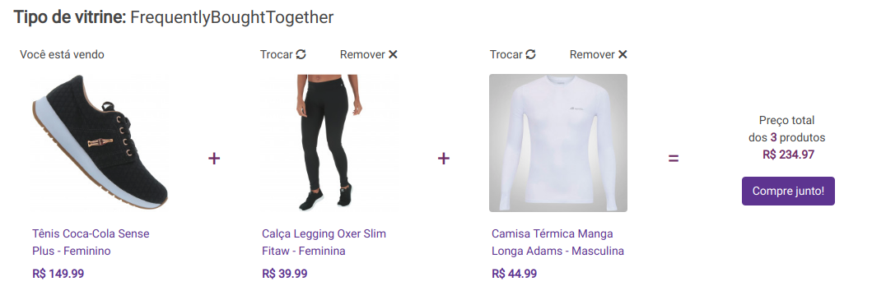

# FBT widget

Widget name: `FrequentlyBoughtTogether`.

## Example

## Interaction

## Behavior

1. `Render widget`: render widget based on api response.
2. `Listen Impression`: if the widget is in the client ViewPort for the first time, the `impressionUrl` should be called..
3. `Listen clicks`: if a product (reference included) is clicked, the `trackingUrl` should be saved in a cookie.. **Obs:** Remember to make the requests saved on cookie when the page loads again.
4. `Listen refresh`: to refresh a card is necessary to pass through the response recs array and get the next rec (if is not displayed). **Obs:** Remember to relisten clicks on products.
5. `Listen remove`: to remove a card is necessary to disable it after click.
