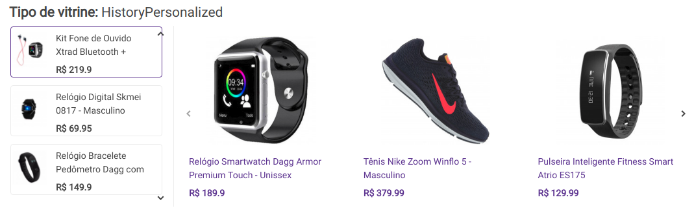
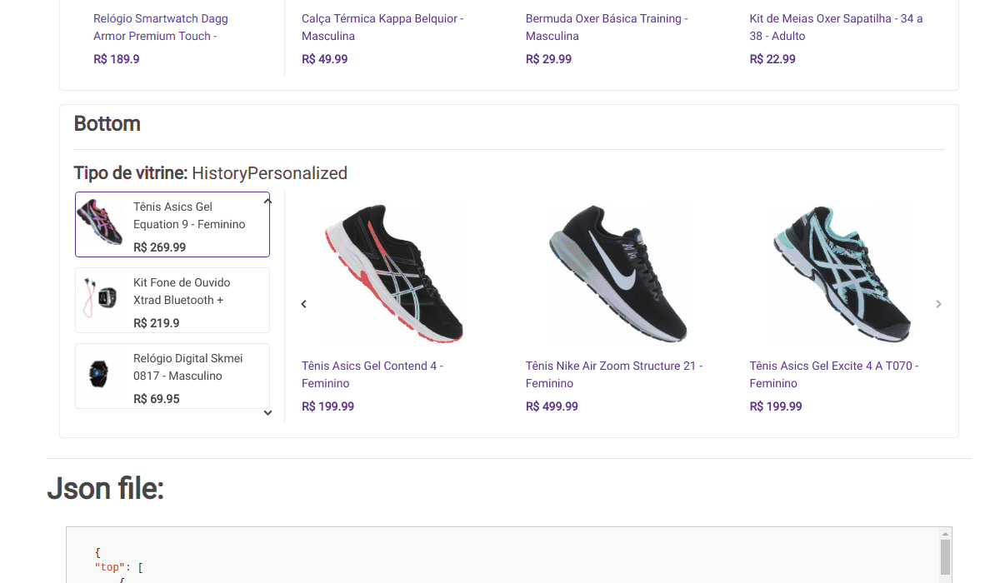

# History widget

Widget name: `HistoryPersonalized`.

## Example

## Interaction

## Behavior

1. `Render widget`: render widget based on api response.
2. `Listen Impression`: if the widget is in the client ViewPort for the first time, the `impressionUrl` should be called.
3. `Listen clicks`: if a product (reference included) is clicked, the `trackingUrl` should be saved in a cookie.. **Obs:** Remember to make the requests saved on cookie when the page loads again.
4. `Listen refresh`: when a new reference is selected is necessary to call `getRecommendationsUrl` and get the new recs. **Obs:** Remember to relisten the impression for the "new widget" and also the clicks on products.

## Singularity

The `history` widget is different of the `default` because it supports a vertical carousel of references.
But the references are optional, so if it is not configured is rendered as a `default` widget.
