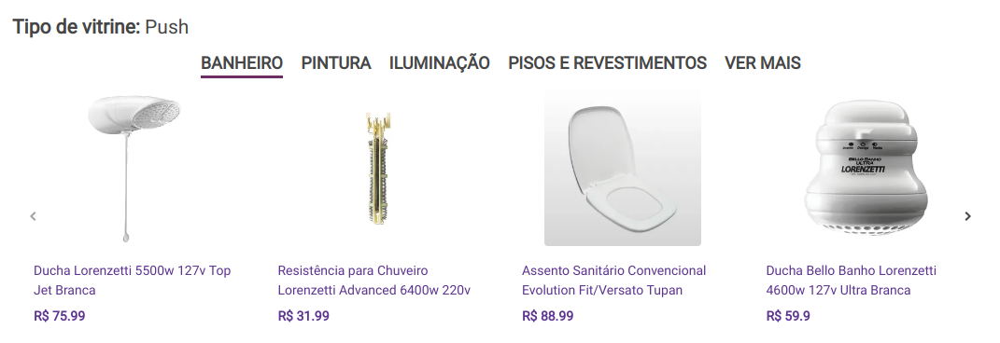
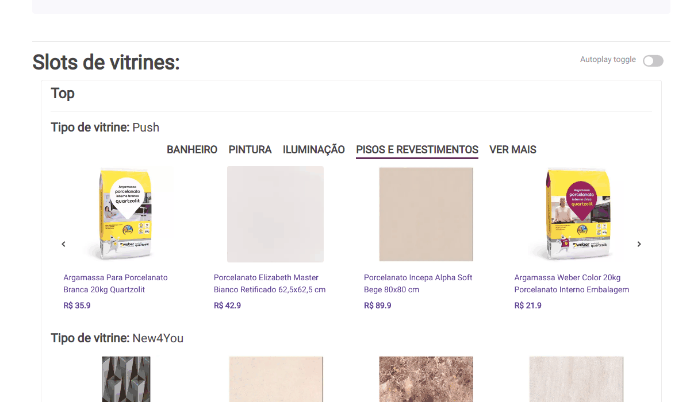

# Push widget

Widget name: `Push`.

## Example

## Interaction

## Behavior

1. `Render widget`: render widget based on api response.
2. `Listen Impression`: if the widget is in the client ViewPort for the first time, the `impressionUrl` should be called..
3. `Listen clicks`: if a product is clicked, the `trackingUrl` should be saved in a cookie.. **Obs:** Remember to make the requests saved on cookie when the page loads again.
4. `Listen refresh` (only if is a menu push): when a different menu is selected the `url` from `menu` should be called to get the new recs. **Obs:** Remember to relisten the impression for the "new widget" and also the clicks on products.

## Singularity

The `push` widget is different of the `default` because it supports exhibition rules, and also a menu for selection of widget.
The menu is optional, so if it does not exists is rendered as a `default` widget.
