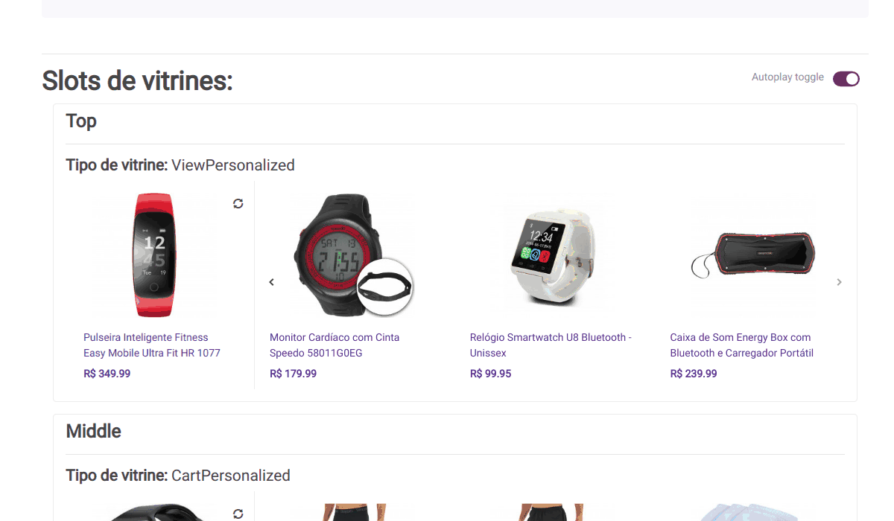

# Reference widget

Widget names: `ViewPersonalized`, `PurchasePersonalized`, `CartPersonalized`, `UltimateBuy`, `Wishlist`.

## Example

## Interaction

## Behavior

1. `Render widget`: render widget based on api response.
2. `Listen Impression`: if the widget is in the client ViewPort for the first time, the `impressionUrl` should be called..
3. `Listen clicks`: if a product (reference included) is clicked, the `trackingUrl` should be saved in a cookie.. **Obs:** Remember to make the requests saved on cookie when the page loads again.
4. `Listen refresh`: when the refresh button is clicked `refreshReferenceUrl` should be called to get new reference and recs. **Obs:** Remember to relisten the impression for the "new widget" and also the clicks on products.
