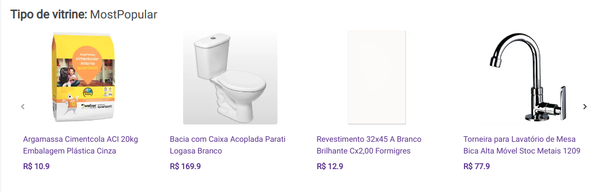

# Default widget

## Example

## Interaction

## Behavior

1. `Render widget`: render widget based on api response.
2. `Listen Impression`: if the widget is in the client ViewPort for the first time, the `impressionUrl` should be called..
3. `Listen clicks`: if a product is clicked, the `trackingUrl` should be saved in a cookie.. **Obs:** Remember to make the requests saved on cookie when the page loads again.
